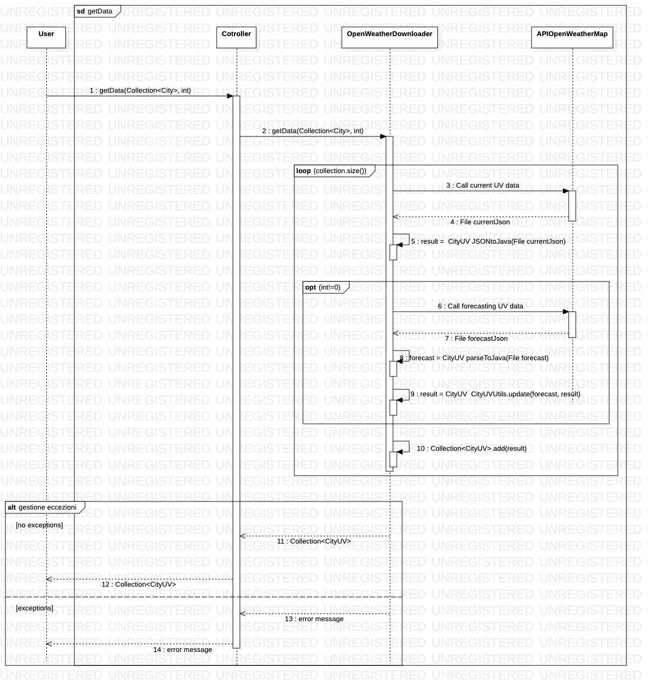

# PO_FabioMecozzi_DavideDeGrazia
Progetto programmazione ad oggetti, appello di Gennaio 2020

##Servizio

Applicazione che permette di ottenere dati sui raggi ultravioletti per tutte le città italiane. Permette inoltre anche di scaricare le previsioni fino a sette giorni.

Rotte dell'applicazione:
*POST:/GetData: permette di scaricare file json contenenti dati sui dati uv odierni (disponibili ogni giorno dopo le 12:30, ora inglese), permette inoltre che nel file json vi siano inserite anche le previsioni fino a sette giorni.
*POST:/GetStatistics/{city}: Permette di scaricare un file jsono contenente statistiche (massimo, minimo, varianza e media) su una o più città a scelta, su un periodo a scelta e/o considerando solo città che hanno avuto un percentuale minima di previsioni azzaeccate.
*GET:/MonitoredCities: Permette di scaricare un json contenente una lista di città che sono monitorate dall'applicazione, sulle quali è possibile calcolare le statistiche.
*POST:/MonitoredCities: Permette di aggiornare le città monitorate scegliendo quali città smettere di sseguire e quali invece iniziare a campionare. Restituisce infine la lista aggiornata delle città moniitorate.
*GET:/GetErrorLog: Permette di scaricare il log delle eccezioni che sono state salvate durante l'esecuzione dell'applicazione.

Le ultime due rotte sopraelencate possono essere raggiunte solo se si è in possesso della chiave presente in application.properties (voce "application.adminKey").

Nel file [UML.mdj](https://aangrw.db.files.1drv.com/y4mEhRW6T5TB0O0Mho701IYnQXQdDOJF2mQIUPNw_R71E2z5FatOYllR78DkHytWX_s-z2WZ69ykeVfNwLCduu1MFWid4BNliwPp9FYPhB1qqdcoyDOqG2T03lKZzPiVdvYNbpL37gHcxiQJ5Eux9jGGmxijLTeBb1gtI7e4VUQezMYX_q2GLxltMmZADDv3Nse?width=1633&height=961&cropmode=none) sono presenti dei diagrammi di classi, casi d'uso e sequenze, alcuni dei quali sono stati seguiti durante la realizzazione dell'applicazione. Invece alcune classi del programma non seguono fedelmente i diagrammi ma in ogni caso la realizzazione non si discosta di molto dal progetto iniziale, eccetto per alcuni diagrammi delle classi.

##Guida all'uso
###POST:/GetData
Per ottenere i dati riguardanti delle città, attraverso un richiesta post, inviare un json che rappresenti una lista di città. Inoltre si può specificare un header denominato "forecastingDays": se tale header è uguale a zero o mancante verranno scaricati solamente i dati UV odierni, se è uguale ad n verranno caricati i dati odierni e le previsioni per i prossimi n giorni.
**Diagramma delle** **sequenze:**

