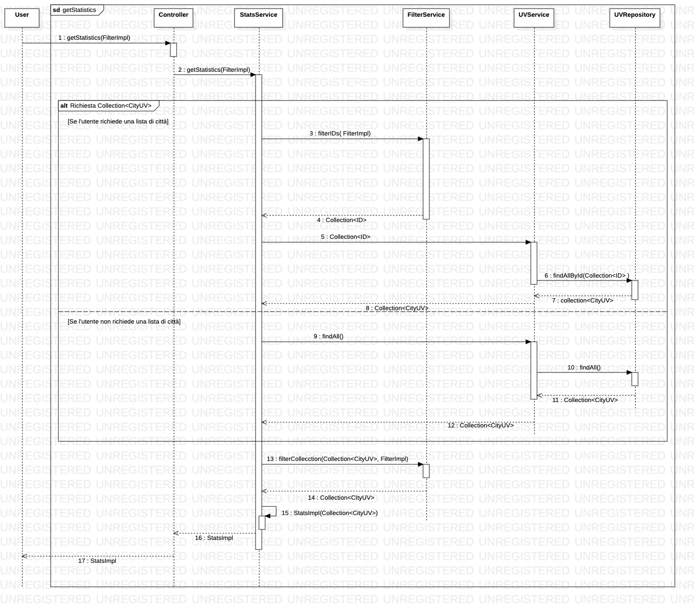
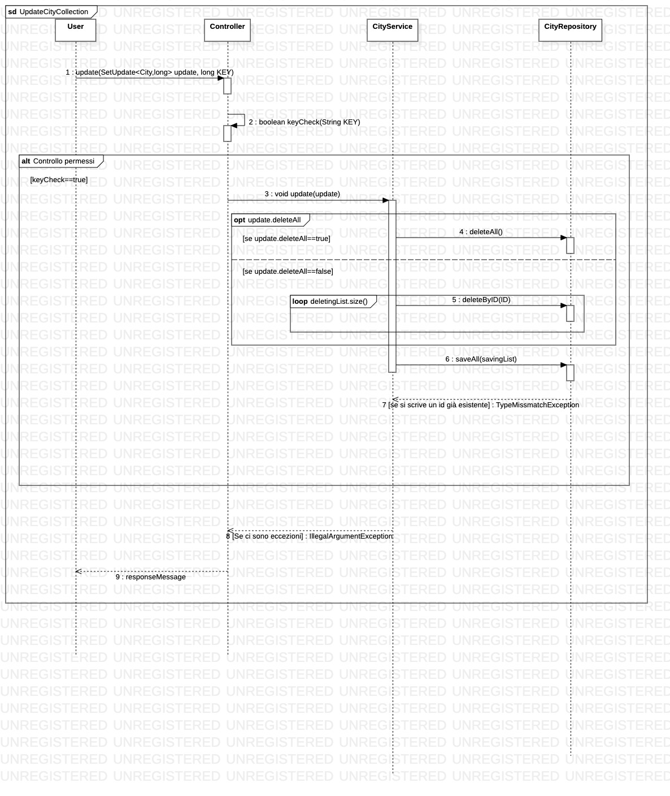
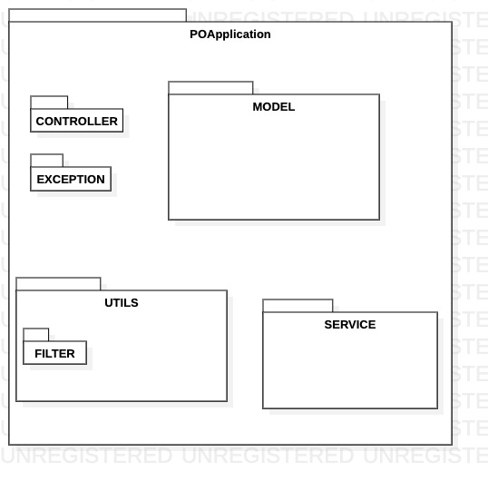
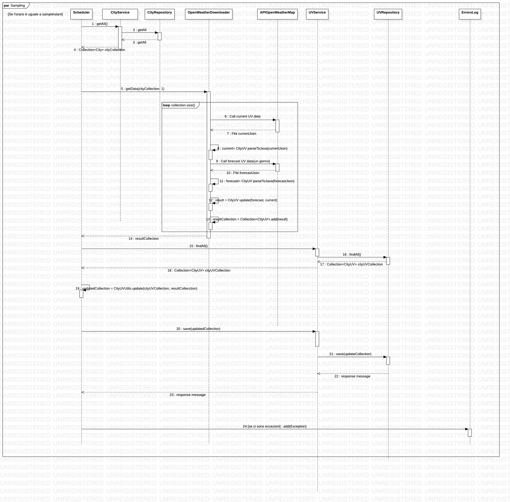

# PO_FabioMecozzi_DavideDeGrazia
Progetto programmazione ad oggetti, appello di Gennaio 2020

## Servizio

Applicazione alla base del servizio web REST API che permette di ottenere dati sui raggi ultravioletti per tutte le città italiane. Permette inoltre anche di scaricare le previsioni fino a sette giorni.

L'applicazione si basa sull'[API](https://openweathermap.org/api/uvi#fgeo) di OpenWeathewMap sui dati ultravioletti.

Rotte dell'applicazione:
*POST:/GetData: permette di scaricare file json contenenti dati sui dati uv odierni (disponibili ogni giorno dopo le 12:30, ora inglese), permette inoltre che nel file json vi siano inserite anche le previsioni fino a sette giorni.
*POST:/GetStatistics/{city}: Permette di scaricare un file jsono contenente statistiche (massimo, minimo, varianza e media) su una o più città a scelta, su un periodo a scelta e/o considerando solo città che hanno avuto un percentuale minima di previsioni azzaeccate.
*GET:/MonitoredCities: Permette di scaricare un json contenente una lista di città che sono monitorate dall'applicazione, sulle quali è possibile calcolare le statistiche.
*POST:/MonitoredCities: Permette di aggiornare le città monitorate scegliendo quali città smettere di sseguire e quali invece iniziare a campionare. Restituisce infine la lista aggiornata delle città moniitorate.
*GET:/GetErrorLog: Permette di scaricare il log delle eccezioni che sono state salvate durante l'esecuzione dell'applicazione.

Le ultime due rotte sopraelencate possono essere raggiunte solo se si è in possesso della chiave presente in application.properties (voce "application.adminKey").

Nel file [UML.mdj](https://aangrw.db.files.1drv.com/y4mEhRW6T5TB0O0Mho701IYnQXQdDOJF2mQIUPNw_R71E2z5FatOYllR78DkHytWX_s-z2WZ69ykeVfNwLCduu1MFWid4BNliwPp9FYPhB1qqdcoyDOqG2T03lKZzPiVdvYNbpL37gHcxiQJ5Eux9jGGmxijLTeBb1gtI7e4VUQezMYX_q2GLxltMmZADDv3Nse?width=1633&height=961&cropmode=none) sono presenti dei diagrammi di classi, casi d'uso e sequenze, alcuni dei quali sono stati seguiti durante la realizzazione dell'applicazione. Invece alcune classi del programma non seguono fedelmente i diagrammi ma in ogni caso la realizzazione non si discosta di molto dal progetto iniziale, eccetto per alcuni diagrammi delle classi.

## Guida all'uso
### POST:/GetData
Per ottenere i dati riguardanti delle città, attraverso un richiesta post, inviare un json che rappresenti una lista di città. Inoltre si può specificare un header denominato "forecastingDays": se tale header è uguale a zero o mancante verranno scaricati solamente i dati UV odierni, se è uguale ad n verranno caricati i dati odierni e le previsioni per i prossimi n giorni.
**Diagramma delle** **sequenze:**


### POST:/GetStatistics/{city}
Rotta per ottenere statistiche filtrate.
Esse possono essere calcolate su una città (path variable) o su una lista di città. Se sono entrambi mancanti le statistiche vengono effettuate su tutte le città monitorate dall'applicazione. Per sapere quali città sono monitorate richiedere la rotta *GET:/MonitoredCities*.
Inoltre nel body è inoltre possibile specificare specificare l'accuracy minima che le città devono avere per essere prese in considerazione nel calcolo della statistica.
**Esempio di body filtro:**
```
{
   "name":  { 
                    “$not" : [ Roma,
                                   Milano,
                                   Ascoli Piceno ]
                  }
   “accouracy": {
                           "$bt": [ 0.4, 
                                        0.9  ]
                         }
}
```

**Diagramma delle sequenze:**


### GET:/MonitoredCities
Rotta che restituisce un json costituito da un array di città monitorate.

### POST:/MonitoredCities
Rotta per modificare la lista delle città monitorate attraverso un body che rappresenti un oggetto della classe [CollectionUpdate](Progetto/src/main/java/com/example2/demo2/model/CollectionUpdate.java)  formattato come segue:
```
{
   "delteAll": "false",
 
   "deletingList" : [ 1234,
                      5678,
                      9876,
                      3724 ],

   "savingList" : [ 2364,
                    1290 ]

}
```
Al termine dell'operazione verrà restituito un json contenente la nuova lista delle città monitorate.
**Diagramma delle sequenze:**


### GET:/GetErrorLog
Restituisce il log delle eccezioni, tra cui le eccezioni che si sono verificate durante il download dei dati di openweather  ([DownloadException](Progetto/src/main/java/com/example2/demo2/exception/DownloadException.java)) e le eccezioni generate dal controller([ControllerEception](Progetto/src/main/java/com/example2/demo2/exception/ControllerException.java))
## Package
**Package diagram:** 


 ## Scheduled tasks
 Il sampling dei dati è cadenzato dallo [Scheduler](
PO_FabioMecozzi_DavideDeGrazia/Progetto/src/main/java/com/example2/demo2/service/Scheduler.java /) il quale ogni giorno alle 12:30 ora inglese (13:30 ora italiana) effettua una serie di chiamate all'[API](https://openweathermap.org/api/uvi#fgeo) di OpenWeathewMap per scaricare i dati delle varie città e le previsioni per il giorno successivo, dopodichè attraverso il [CityUVService](Progetto/src/main/java/com/example2/demo2/service/CityUVService.java) aggiorna la [repository](Progetto/src/main/java/com/example2/demo2/repository/CityUVRepository.java) e nel far ciò l'applicazione tiene conto delle previsioni corrette, delle previsioni totali e della precisione delle previsioni per ogni città.
Se l'operazione non va a buon fine per qualche città, lo scheduler prova a riscricare le città non scaricate ogni mezzora fino alle 12:30 del giorno successivo. Ancora, se neaanche queste operazioni vanno a buon fine, le città non scaricate vengono salvate nell'eccezione personalizzata [DownloadException](Progetto/src/main/java/com/example2/demo2/exception/DownloadException.java) che viene salvata nell'errorLog in [Log](Progetto/src/main/java/com/example2/demo2/model/Log.java)
**Diagramma delle sequenze(sampling):**


## Autori

* **Fabio Mecozzi** - [GitHub](https://github.com/FabioMecozzi)
* **Davide De Grazia** - [GitHub](https://github.com/davidedegrazia)
